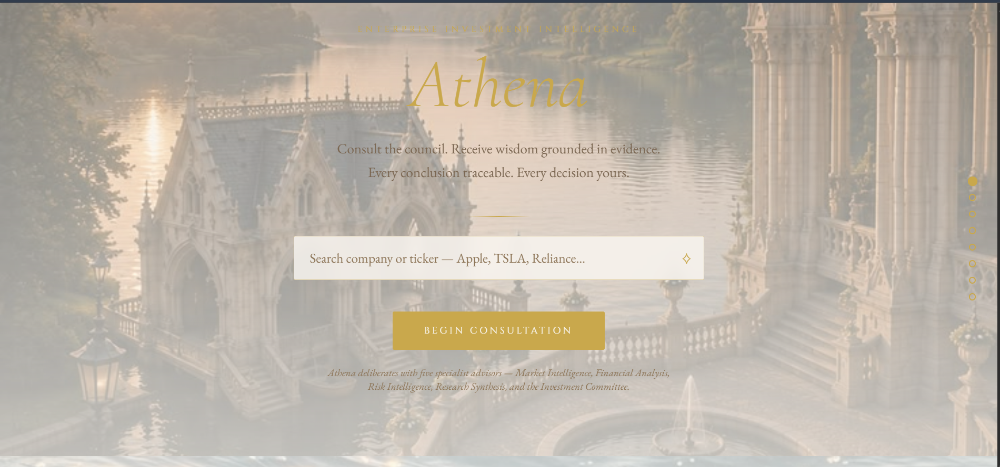
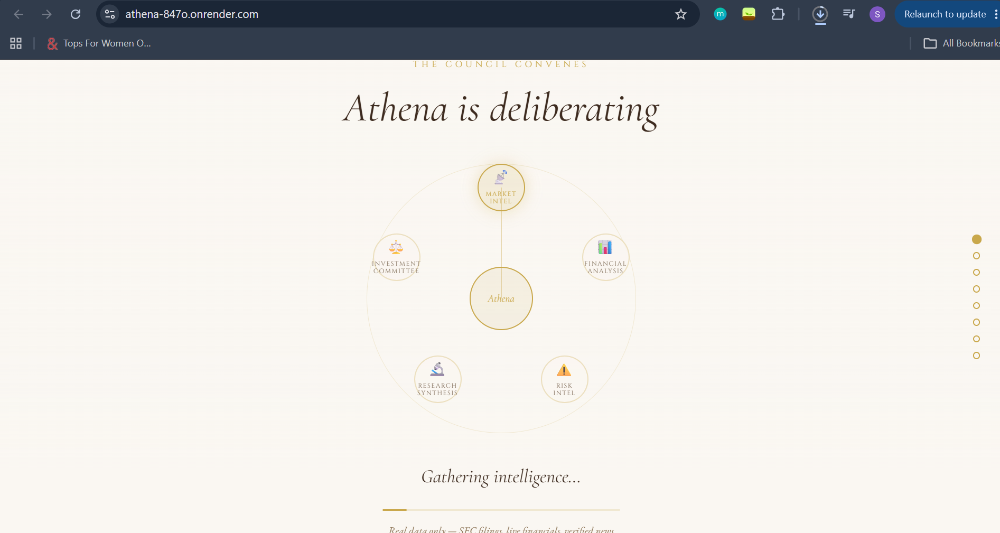
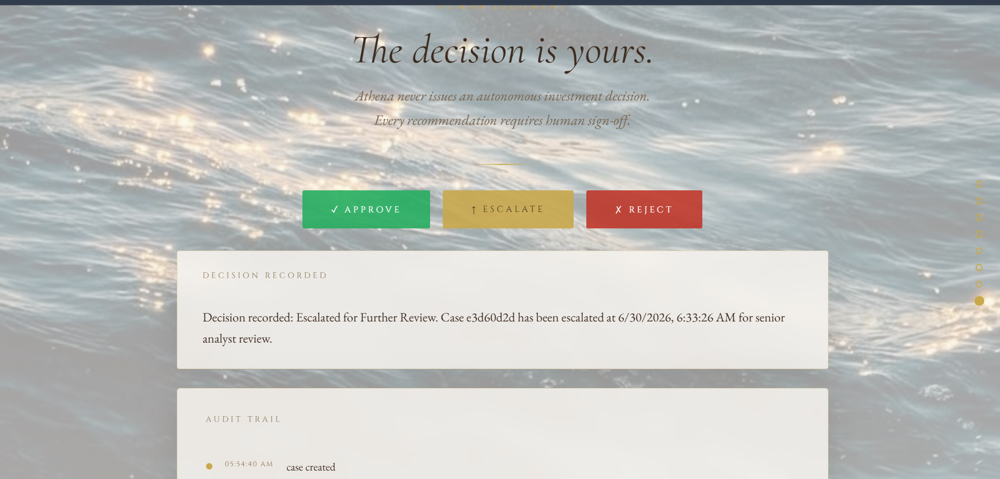

# Athena
### Enterprise Multi-Agent Investment Intelligence Platform 

 An enterprise-grade, multi-agent investment intelligence platform that combines deterministic financial analysis, explainable AI reasoning, and human approval into a single auditable workflow.

> **Not another chatbot.**
>
> Athena separates retrieval, computation, reasoning, and approval into specialized AI agents ensuring every investment recommendation is explainable, evidence-backed, and reviewed by a human before action.

> Enterprise-grade multi-agent investment intelligence in under 5 minutes. Every calculation is deterministic. Every recommendation is explainable. Every decision requires a human.

**Built for UiPath AgentHack 2026 - Track 1: UiPath Maestro Case**

[Live Demo](https://athena-847o.onrender.com) · [Demo Video](https://youtu.be/FDeIEF6Y3iY) 

---

## Key Features

- Multi-agent investment committee architecture
- Deterministic financial ratio computation zero AI involved
- Rule-based, threshold-driven risk intelligence
- Explainable AI recommendations, never autonomous decisions
- Human-in-the-loop approval workflow (Approve / Reject / Escalate)
- Full audit trail and case lifecycle, orchestrated via UiPath Maestro Case
- Real-time financial statements and news data no hardcoded figures

## What Athena Does

Give Athena a ticker. It orchestrates five specialized agents that read real filings, compute real ratios, flag real risks, and produce a fully evidence-backed investment memo  then routes it to a human for Approve / Reject / Escalate.

```
User
  │
  ▼
UiPath Maestro Case
  │
  ▼
Market Intelligence   → real-time profile, filings, financials, news
  │
  ▼
Financial Analysis    → 9 ratios, deterministic, zero AI
  │
  ▼
Risk Intelligence     → rule-based threshold flags, evidence-linked
  │
  ▼
Research Synthesis    → LLM synthesis, constrained to provided data
  │
  ▼
Investment Committee  → weighted scoring + LLM-explained, never decided
  │
  ▼
Human Approval         (Approve / Reject / Escalate)
  │
  ▼
Audit Trail
```

## Why Athena?

Traditional investment assistants rely on a single LLM prompt, making calculations opaque and recommendations difficult to verify.

Athena separates retrieval, computation, reasoning, and approval into specialized agents so every conclusion is traceable, deterministic where required, and always reviewed by a human before becoming actionable.

## Why This Architecture

Most "AI investment assistant" projects let one LLM call do everything — fetch, analyze, and recommend in a single black-box prompt. Athena deliberately separates **retrieval**, **computation**, and **reasoning** into distinct agents so that:

- **Every insight is grounded in retrieved evidence and deterministic analysis.** All 9 financial ratios (ROE, ROIC, margins, liquidity, leverage, growth, free cash flow) are computed with plain Python arithmetic on real financial statements no LLM touches a single calculation.
- **Risk flags are rule-based, not vibes.** Liquidity, leverage, profitability, growth, and cash-flow risk are triggered against fixed numeric thresholds, each with the exact evidence that tripped it.
- **The LLM only synthesizes what it's given.** The Research Synthesis and Investment Committee agents receive a structured JSON package (metrics, risk flags, headlines) and are explicitly instructed not to introduce outside facts or recalculate anything.
- **Final investment decisions remain exclusively with the human reviewer.** The Investment Committee agent produces a weighted confidence score across four dimensions it explains why the score is what it is, then hands off to a human. `requires_human_approval` is hardcoded `true`; it is not something the system can override.
- **Every case is auditable.** A `CaseState` object travels through the full pipeline, logging every stage transition, every agent's output, every error, and the final human decision with a timestamp.

## UiPath Maestro Case Integration

Athena's six-stage lifecycle is modeled as a published UiPath Maestro Case app (Track 1), mapping 1:1 onto the agent pipeline:

`Market Intelligence → Financial Analysis → Risk Intelligence → Research Synthesis → Investment Committee → Human Approval`

## UiPath Components Used

- **UiPath Maestro Case** — Athena's full 6-stage case lifecycle (Market Intelligence → Financial Analysis → Risk Intelligence → Research Synthesis → Investment Committee → Human Approval) is modeled and published as a Maestro Case app, built in UiPath Studio Web on UiPath Automation Cloud.
- **UiPath Automation Cloud** — hosting environment for the published Case app and sandbox used during development.

## Agent Type

Athena's five analysis agents (Market Intelligence, Financial Analysis, Risk Intelligence, Research Synthesis, Investment Committee) are **coded agents** — implemented as standalone Python modules with explicit logic, deterministic calculations, and constrained LLM calls (Gemini 2.5 Flash) where reasoning is required. They are not built using UiPath's low-code Agent Builder; the orchestration layer and case lifecycle they map onto is UiPath Maestro Case.

## Setup Instructions (for Judging)

1. **Live demo:** visit the deployed site at `<your Render URL>` — no setup required. Enter a ticker (e.g. `AAPL`, `TSLA`) and run an analysis.
2. **UiPath Maestro Case:** the published case plan can be viewed in UiPath Studio Web under the "Athena" solution — 6 stages, each mapped to one pipeline agent plus human approval.
3. **To run locally:**
   ```bash
   git clone https://github.com/soumyyaa16/Athena.git
   cd Athena
   pip install -r requirements.txt
   ```
   Create a `.env` file in the root with:
   ```
   NEWS_API_KEY=your_key
   FMP_API_KEY=your_key
   GEMINI_API_KEY=your_key
   ```
   Then run:
   ```bash
   python app.py
   ```
   Visit `http://localhost:5000`.
4. **To run the pipeline directly (no UI):**
   ```bash
   python orchestrator.py AAPL
   ```
   Prints full agent output and saves a complete audit-trail JSON to `outputs/`. 

This gives Athena's case lifecycle the same orchestration, stage tracking, and human-in-the-loop case management that UiPath Maestro provides for real enterprise workflows rather than a single opaque script.

## Screenshots

### Dashboard


### Committee Deliberation



### Human Approval


## Tech Stack

| Layer | Tool |
|---|---|
| Orchestration | UiPath Maestro Case |
| Agents | Python |
| LLM | Gemini 2.5 Flash |
| Financial data | yfinance, Financial Modeling Prep |
| News | NewsAPI |
| Backend | Flask |
| Frontend | Custom HTML/CSS + Vanilla JavaScript |
| Deployment | Render |

## Example Output

Real runs from this system, unedited:

| | AAPL (Apple) | TSLA (Tesla) |
|---|---|---|
| Overall Score | 68.3 / 100 | 37.4 / 100 |
| Classification | Stable Fundamentals | Mixed Fundamentals |
| Profitability | 99.2 | 9.1 |
| Financial Health | 43.3 | 95.5 |
| Growth | 57.1 | 10.3 |
| Key flag | Liquidity risk (current ratio 0.89) | Revenue contraction (-2.93% YoY) |

Two genuinely different financial profiles, correctly differentiated by the same pipeline — nothing templated.

## Running Locally

```bash
git clone https://github.com/soumyyaa16/Athena.git
cd Athena
pip install -r requirements.txt
```

Create a `.env` file in the root:

```
NEWS_API_KEY=your_key
FMP_API_KEY=your_key
GEMINI_API_KEY=your_key
```

Run it:

```bash
python app.py
```

Visit `http://localhost:5000`.

You can also run the pipeline directly from the command line:

```bash
python orchestrator.py AAPL
```

This prints the full agent output and saves a complete audit-trail JSON to `outputs/`.

## Project Structure

```
Athena/
├── agents/
│   ├── market_intelligence.py
│   ├── financial_analysis.py
│   ├── risk_intelligence.py
│   ├── research_synthesis.py
│   └── investment_committee.py
├── core/
│   ├── state.py           # case state object + audit log
│   ├── fallback.py        # retry / backoff for external APIs
│   └── reconciler.py      # cross-source data reconciliation
├── schemas/                # JSON contracts per agent
├── templates/index.html    # frontend
├── orchestrator.py
├── app.py
└── requirements.txt
```

## Roadmap

- **V2** — DCF valuation, comparable company analysis
- **V3** — Portfolio-level analysis, sector comparison, watchlists
- **V4** — Corporate actions tracking
- **V5** — Delta reports ("what changed since the last memo")

## Built By

**Soumya Singh**

Built independently for UiPath AgentHack 2026, demonstrating enterprise-grade multi-agent orchestration, explainable AI, and human-in-the-loop investment decision support. 